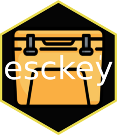

# esckey 

<!-- badges: start -->
[](https://lifecycle.r-lib.org/articles/stages.html#experimental)
<!-- badges: end -->

The goal of esckey is to make debugging shiny apps easier by allowing the Esc key to activate the browser.

## Installation

You can install the development version of esckey like so:

``` r
remotes::install_github("TheZetner/esckey")
```

## Example

Add the two functions from esckey into your UI (`escUI()`) and server (`escServer(i = input, o = output)`) and run your app.  
Hit Esc while running to browse.  
Nice.  

``` r
library(shiny)
library(esckey)

ui <- fluidPage(
  "Hit Esc to browse",
    numericInput("num",
                 label = "Number",
                 value = 2),
    textInput("text",
              "Text",
              value = "Placeholder"),
 escUI()
)
server <- function(input, output, session) {
  foo <- "bar"
  escServer(i = input,
            o = output,
            foo = foo)
}

shinyApp(ui, server)


```


[Extremely cool Flaticon provided by Konkapp](https://www.flaticon.com/free-icons/water-cooler)  
[Hex Sticker made with Hexmake](https://github.com/colinfay/hexmake)
